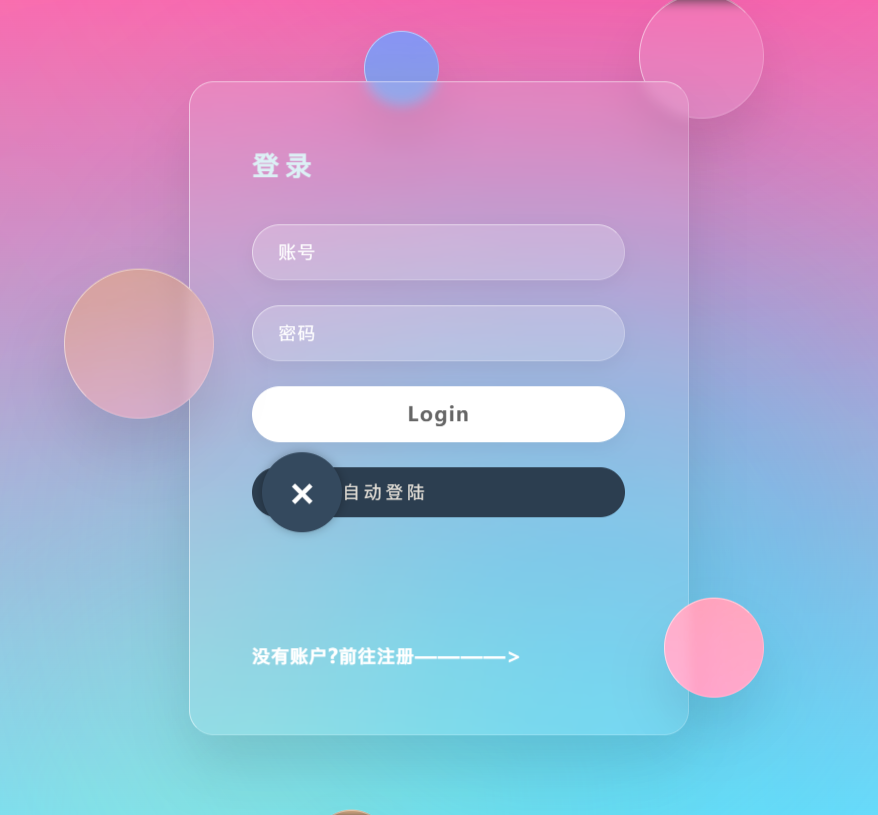
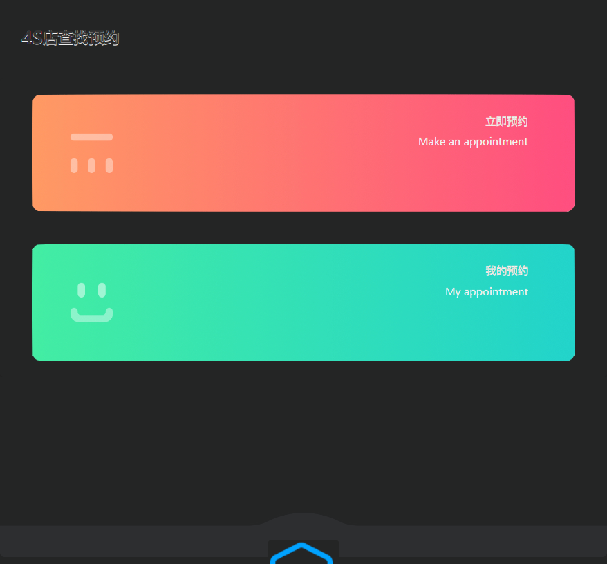
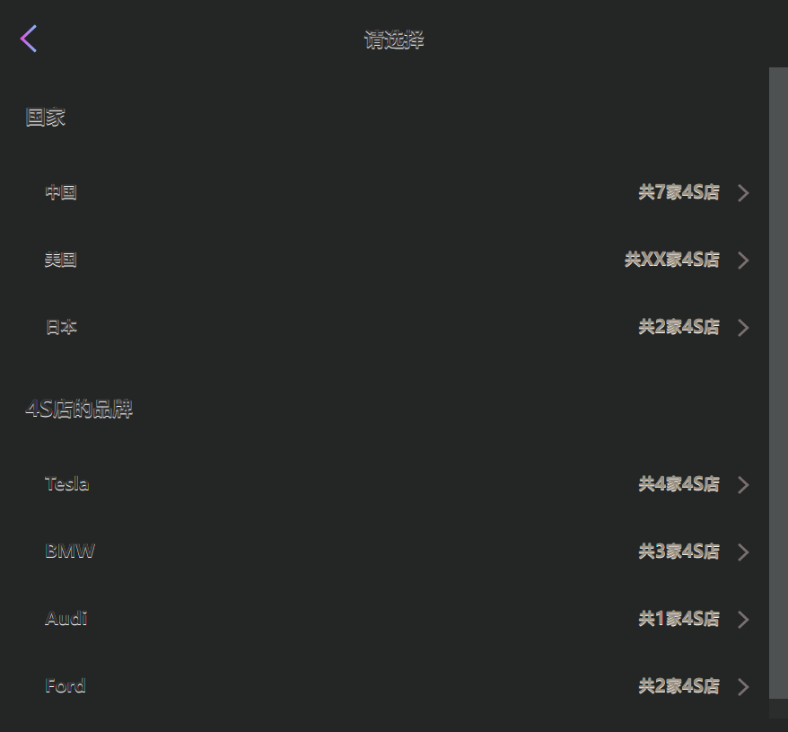
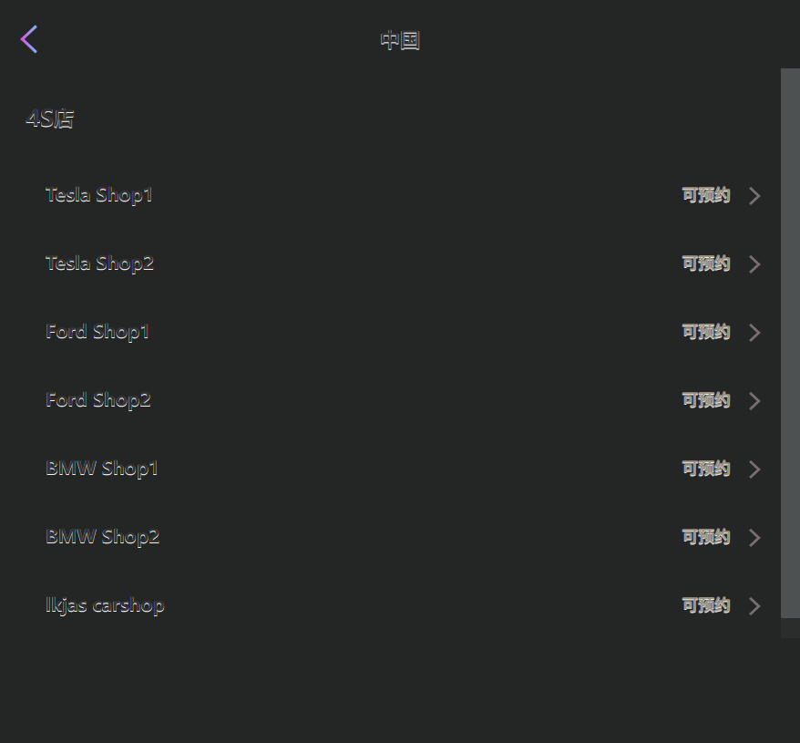
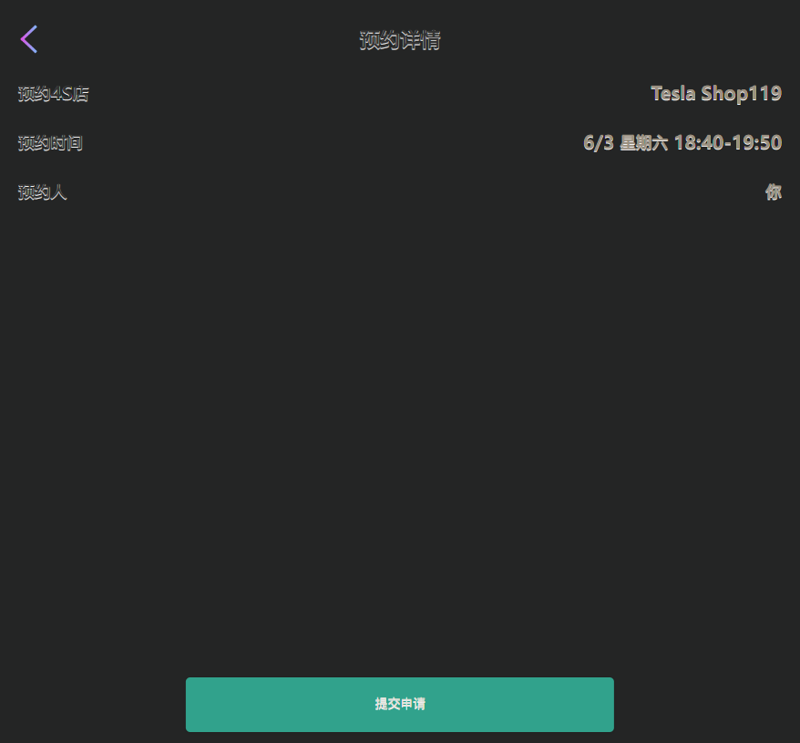
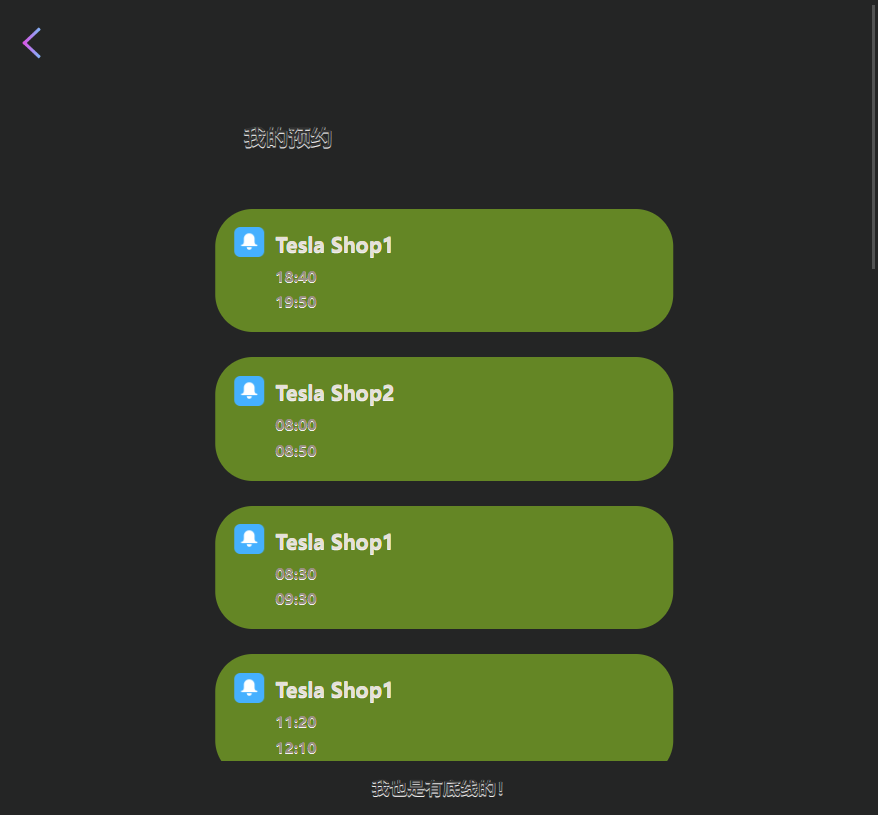
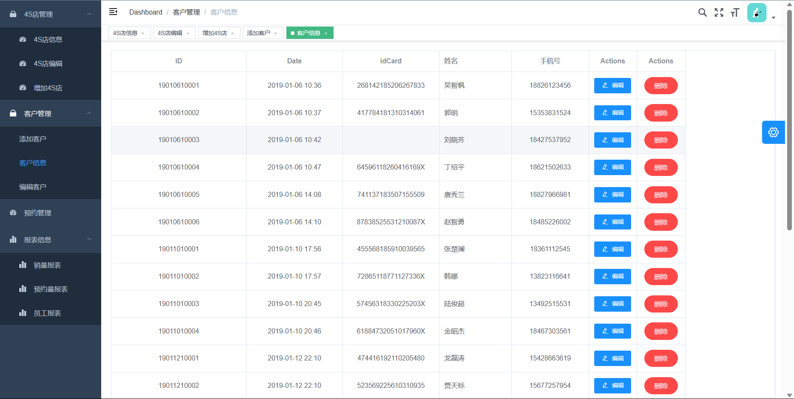

# 汽车销售管理系统 (Car Sales Management System)

这是一个功能全面的汽车销售管理系统，旨在为汽车经销商提供一套完整的业务管理解决方案。该项目是一个毕业设计项目，整合了多种现代技术栈，包含了两个独立的后台管理系统（一个基于 Java + Vue，另一个基于 .NET Blazor）和一个简单的前端客户门户。

## 项目概述

本项目主要分为三个独立但功能相关的部分：

1.  **核心后台系统 (`carsale-master2`)**: 使用 **Java (Spring Boot)** 作为后端，**Vue.js (基于 vue-element-admin-template)** 作为前端，实现了一套功能强大的后台管理界面，涵盖了员工、客户、车辆、订单和数据图表等核心业务模块。
2.  **Blazor 管理系统 (`BlazorAdminSystem`)**: 使用 **.NET 9 和 Blazor** 技术栈构建的另一个后台管理系统。它直接连接到同一数据库，提供了另一种现代化的UI/UX来管理业务数据，展示了 .NET 在 Web 开发领域的强大能力。
3.  **静态客户门户 (`front`)**: 一个简单的、使用原生 **HTML/CSS/JS** 构建的客户端页面，可能用于展示信息或作为移动端入口。

## 技术栈 (Technology Stack)

### 1. 核心后台 (`carsale-master2`)

-   **后端**:
    -   框架: Spring Boot
    -   构建工具: Maven
    -   数据持久化: MyBatis
    -   数据库: MySQL
-   **前端**:
    -   框架: Vue.js 2
    -   UI 库: Element UI
    -   路由: Vue Router
    -   状态管理: Vuex
    -   HTTP 通信: Axios
    -   构建工具: Webpack

### 2. Blazor 管理系统 (`BlazorAdminSystem`)

-   **框架**: .NET 9, Blazor Server/WASM
-   **数据访问**: Entity Framework Core
-   **UI 组件库**: Radzen Blazor Components
-   **数据库驱动**: Pomelo.EntityFrameworkCore.MySql, MySqlConnector
-   **开发环境**: Visual Studio 2022+

### 3. 通用

-   **数据库**: MySQL 5.7+
-   **开发工具**: VS Code, IntelliJ IDEA, Visual Studio

## 项目结构

```
.
├── BlazorAdminSystem/         # .NET Blazor 管理系统项目
├── carsale-master2/           # Java + Vue 核心后台项目
│   ├── src/                   # Java 后端源码
│   └── front/                 # Vue 前端源码
├── front/                     # 静态 HTML 客户门户
├── images/                    # 项目截图
├── .vscode/                   # VS Code 编辑器配置
├── carsale.sql                # 数据库初始化脚本
├── 12毕业论文.doc             # 项目的详细设计与实现文档
└── readme.md                  # 本文档
```

## 主要功能

-   **用户与权限管理**: 登录、登出、基于角色的访问控制（管理员、销售等）。
-   **员工管理**: 员工信息的增、删、改、查。
-   **客户管理**: 客户信息的录入与维护。
-   **车辆库存管理**:
    -   品牌管理
    -   车系管理
    -   具体车型信息管理（库存、价格等）
-   **销售订单管理**: 创建订单、查看订单详情、修改订单状态。
-   **数据可视化**: 提供销售额、员工业绩等数据的图表化展示。
-   **多管理后台**: 提供两种不同技术栈的后台界面，满足不同操作习惯。

## 部署与运行指南

### 1. 环境准备

-   JDK 1.8+
-   Maven 3.5+
-   Node.js 14.x+
-   .NET SDK 9.0+
-   MySQL 5.7+
-   Git

### 2. 数据库设置

1.  启动您的 MySQL 服务。
2.  创建一个新的数据库 `carsale`。
    ```sql
    CREATE DATABASE carsale CHARACTER SET utf8mb4 COLLATE utf8mb4_unicode_ci;
    ```
3.  将项目根目录下的 `carsale.sql` 文件导入到您刚创建的 `carsale` 数据库中。

### 3. 运行核心后台 (Java + Vue)

#### a. 启动后端 (Java)

1.  使用 IntelliJ IDEA 或 Eclipse 打开 `carsale-master2` 目录。
2.  导航到 `src/main/resources/application.yml`。
3.  修改 `spring.datasource` 部分，填入您的 MySQL 用户名和密码。
4.  运行 `CarsaleApplication.java` 的 `main` 方法启动 Spring Boot 服务。默认端口为 `8080`。

#### b. 启动前端

1.  直接打开`front`下的index.html。


### 4. 运行 Blazor 管理系统

1.  使用 Visual Studio 2022+ 打开根目录下的 `BlazorAdminSystem.sln` 解决方案。
2.  打开 `BlazorAdminSystem/appsettings.json` 文件。
3.  修改 `ConnectionStrings` 下的数据库连接字符串，确保服务器、数据库名、用户名和密码正确。
4.  在 Visual Studio 中按 `F5` 或点击 "启动" 按钮来编译和运行项目。
5.  项目启动后，将在浏览器中打开一个新的管理界面。

## 项目截图


**登录页面**


**主面板/仪表盘**


**客户管理**


**车辆管理**


**订单列表**


**员工信息**


**Blazor 系统界面**


## 文档

本项目详细的设计思路、数据库设计、模块划分和实现细节均记录在 `12毕业论文.doc` 文件中，可供参考。